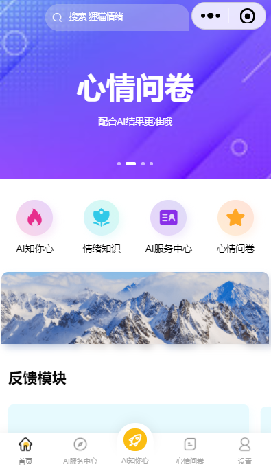
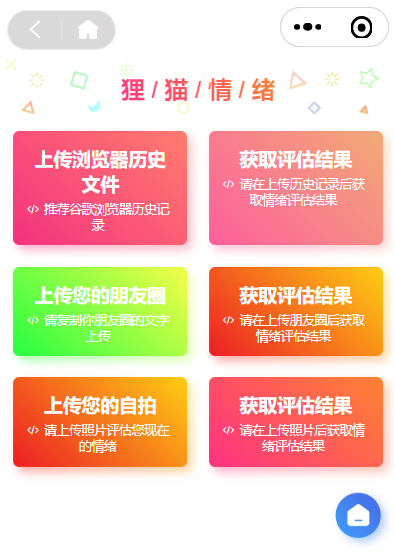
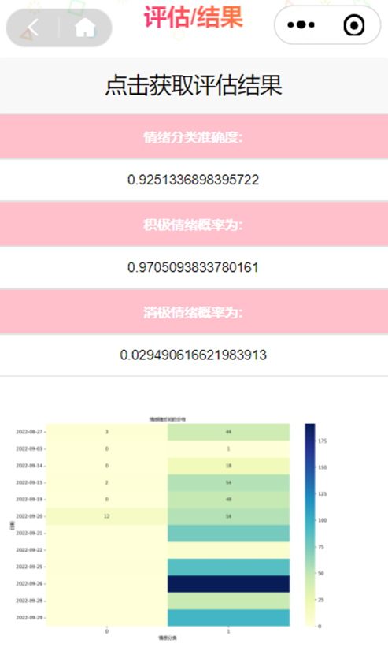
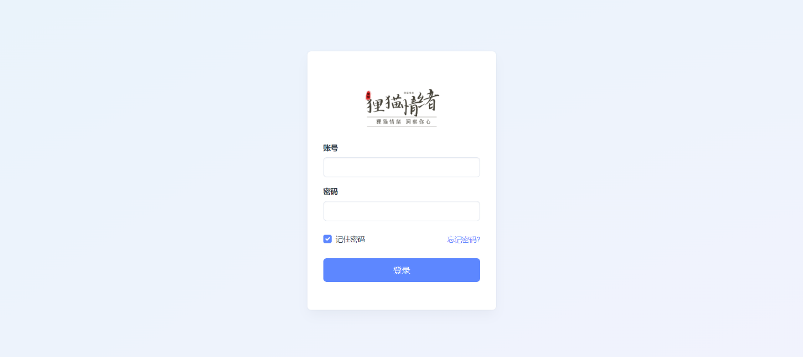
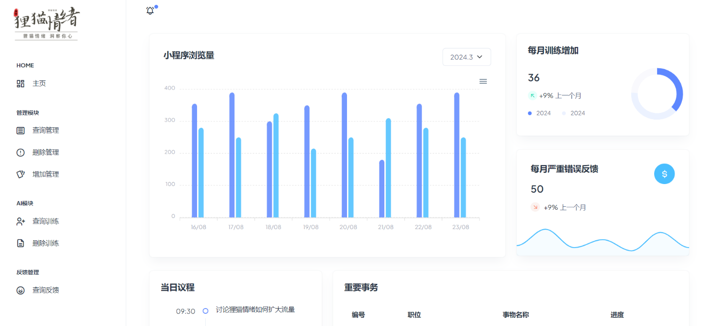
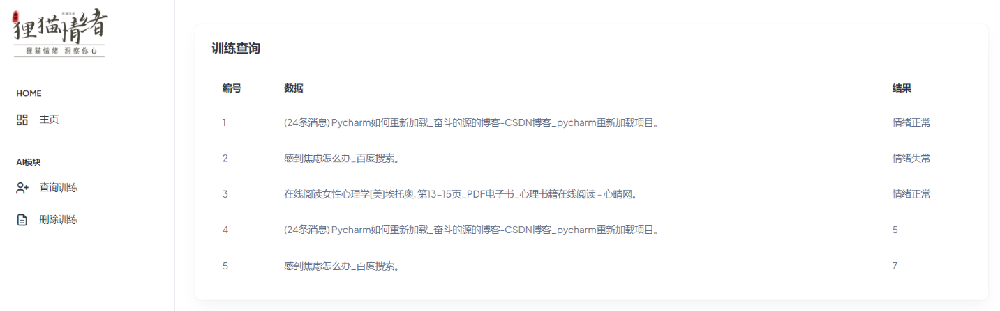

# 狸猫情绪评估系统

---

📖 **本 README 为中文版本**，点击这里查看 [English version](./README_EN.md)  

---

## 1.📖 项目简介
本项目是一个全栈式的情绪健康评估平台，旨在通过多模态数据（文字、面部表情、问卷）为用户提供便捷的心态监测服务。系统采用前后端分离架构，集成了深度学习模型与大语言模型（Gemma），实现了从数据采集、情感分析到可视化反馈的完整闭环。系统分为两部分：
- 前台评估系统：基于微信小程序，面向普通用户提供面部识别、文字分析及情绪问卷评估。
- 后台管理系统：面向管理员，用于数据监控、AI模型训练管理及用户反馈处理。

## 2.🏗 技术架构
本项目采用了多语言混合架构，以发挥不同技术栈的优势：
### （1）核心技术
- 机器学习（监督学习）
- 自然语言处理 (NLP)
- 面部情绪识别
### （2）前台评估系统
- 后端：Python + Flask 框架 
- 前端：Uni-App 框架（发布为微信小程序）
### （3）后台管理系统
- 后端：Java + Spring Boot 框架 
- 前端：jQuery + Bootstrap 框架
### （4）数据库
- MySQL
### （5）大模型支持
- Gemma LLM（用于文本生成与对话分析）

## 3.✨ 核心功能
### （1）多维度评估
支持通过浏览器记录、朋友圈文案、面部照片及专业心理问卷进行情绪检测。
### （2）可视化分析
自动生成情绪热图、压力概率分布图。
### （3）AI 训练中心
用户可参与标注数据，通过有监督学习持续优化模型准确率。
### （4）心理科普
包含心理学知识、人生哲理及精神健康资讯模块。
### （5）反馈闭环
用户反馈直接对接后台管理，实现即时响应。

## 4.📁 数据库设计
核心表结构：
- lifephilosophy / mental_health: 存储知识库内容。
- ailearn3: 存储用户贡献的训练数据集。
- presstable: 记录用户反馈及相关图片资源。

## 5.🚀 快速开始
- Python 3.9+
- JDK 11
- MySQL 8.0
- HBuilderX (用于编译 Uni-App)

## 6.🎓 开发人员
狸猫C型AI

## 7.📦 项目展示
### （1）前台评估系统

 

 

### （2）后台管理系统

 

 

 

---

⭐️ 如果你觉得有帮助，欢迎点个 Star 支持一下！ ⭐️

